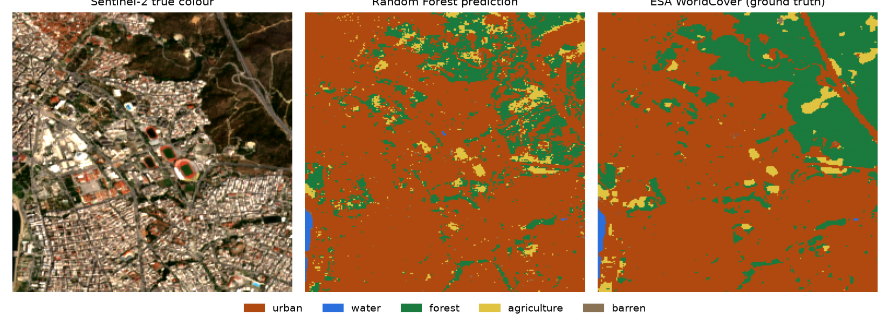
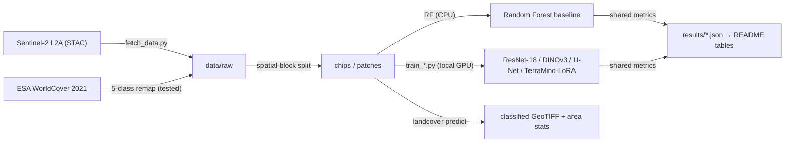
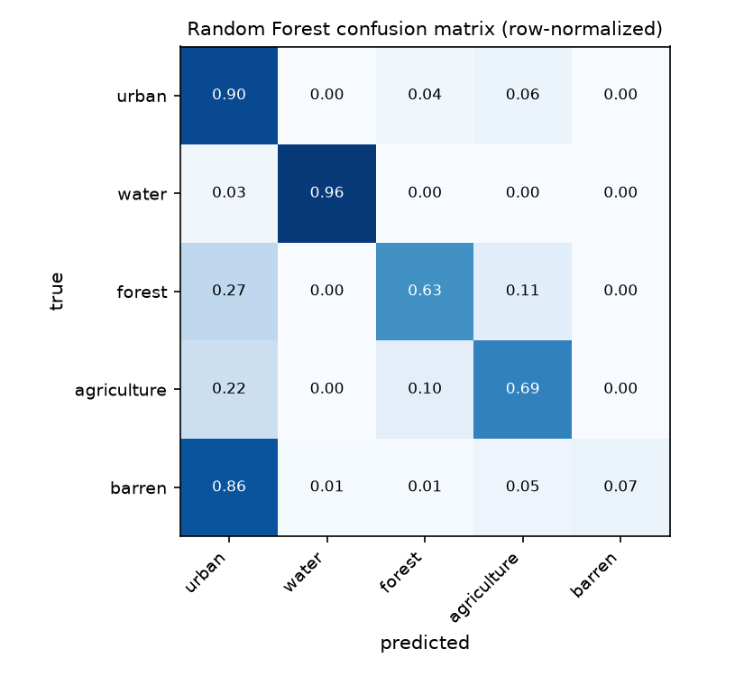

# landcover-sentinel2

[](https://github.com/tarpous/landcover-sentinel2/actions/workflows/ci.yml)

Sentinel-2 land cover as a **study, not just a model**: a classical Random-Forest classifier kept as a baseline and put up against a U-Net and a LoRA-fine-tuned geospatial foundation model on identical, spatially blocked splits — plus a DINOv3 linear probe on EuroSAT and label-efficiency curves. The question it answers is the one that separates a real analysis from a leaderboard entry: **when does the classical method win, and when does the extra model capacity earn its cost?**

The classical core — spectral indices, a five-class scheme with a unit-tested ESA-WorldCover remap, per-pixel and per-patch Random Forests, shared metrics, and spatially blocked splits — is fully tested and CPU-only. The deep and foundation-model tracks run through headless GPU scripts that import the same tested package, so the comparison is fair by construction and the only untested surface is the training call itself.

## Two tracks

- **Track 1 — EuroSAT patch classification:** Random Forest on spectral indices vs a fine-tuned ResNet-18 vs a DINOv3 satellite linear probe, reported against published EuroSAT numbers.
- **Track 2 — Sentinel-2 segmentation:** per-pixel Random Forest vs a U-Net vs a LoRA-fine-tuned geospatial foundation model (TerraMind via TerraTorch), on ESA-WorldCover-supervised chips over a Thessaloniki AOI, with per-class F1/IoU and a **label-efficiency curve** (performance at 10 / 25 / 100 % of training labels — the argument foundation-model papers make).



## Results

<!-- results:begin -->
### Track 1 — EuroSAT patch classification

**Dataset:** EuroSAT (MSI) · five target classes

| Model | Overall accuracy | Macro-F1 | Test patches |
|---|---:|---:|---:|
| Random Forest (spectral indices) | 0.885 | 0.860 | 5400 |
| ResNet-18 (RGB fine-tune) | 0.972 | 0.968 | 5400 |

### Track 2 — Sentinel-2 segmentation

| Model | Overall accuracy | mean IoU | Macro-F1 |
|---|---:|---:|---:|
| Random Forest (per-pixel) | 0.904 | 0.551 | 0.635 |
| U-Net (100% labels) | 0.873 | 0.446 | 0.513 |

**Label-efficiency curve (U-Net mean IoU):**

| Training labels | 10% | 25% | 100% |
|---|---:|---:|---:|
| mean IoU | 0.335 | 0.327 | 0.446 |

<!-- results:end -->

Every number is generated from the committed metrics JSONs by `scripts/make_results_table.py`; the deep-model rows are real local GPU runs on an RTX 4080 SUPER, scored through the same `landcover.metrics` as the classical baselines.

**When does the classical method win?** The two tracks answer it in opposite directions, which is the point. On **EuroSAT** — 27 000 clean labelled patches — the fine-tuned ResNet-18 clears the Random Forest by a wide margin (OA 0.97 vs 0.89): abundant labels reward model capacity. On the **Sentinel-2 segmentation** track — one small Thessaloniki AOI, only a handful of WorldCover-supervised chips — the per-pixel **Random Forest beats the U-Net** (mean IoU 0.55 vs 0.45), because a data-hungry segmentation network cannot out-learn the RF's spectral separability from so few labels. That is the honest, reproducible thesis of the whole repo: deep models win when labels are plentiful; the ~100× cheaper classical baseline wins in the low-label regime, exactly where a foundation model's label efficiency is supposed to help (the next model to add). The label-efficiency curve is noisy at this dataset size — read the 10%→100% endpoints, not the wiggle — and a larger AOI would lift the U-Net; both caveats are stated rather than hidden.

## Quickstart

Offline, from committed sample fixtures (< 5 min):

```bash
uv sync
uv run pytest            # indices, class remap, metrics, RF, spatial splits, CLI — all offline
uv run landcover rf-eval --chips data/sample/chips
```

Train the deep models on a local GPU (or any CUDA machine):

```bash
uv sync --group train        # CPU torch + timm + segmentation-models-pytorch
# then swap in the CUDA build for your card, e.g. Ada / RTX 40-series:
uv pip install --reinstall torch torchvision --index-url https://download.pytorch.org/whl/cu124

# Track 1 — real EuroSAT MS (2 GB, md5-verified):
uv run python scripts/fetch_data.py --eurosat
uv run python scripts/train_eurosat.py --root data/raw/eurosat --epochs 20

# Track 2 — Sentinel-2 composite + WorldCover chips over an AOI (needs pystac-client + stackstac):
uv pip install pystac-client stackstac
uv run python scripts/fetch_data.py --aoi 22.7 40.5 23.2 40.8 --chip 256   # wider Thessaloniki
uv run python scripts/train_segmentation.py --root data/raw/chips --epochs 40
```

The training wiring is guarded by a CPU smoke test (`pytest -m smoke`, a separate CI job) that runs each script's `--smoke` path on the sample fixtures, so the load→train→score path can't silently break. The TerraMind LoRA track runs from the Docker CUDA container to keep the Linux-first EO stack off the host.

## How it works



Three choices carry the study:

- **Weak supervision, stated plainly.** WorldCover is itself a model output; using it to supervise a segmentation model is weak supervision, and the remap from its 11 classes to the five targets is unit-tested because a wrong code mapping silently corrupts every downstream metric.
- **Spatially blocked splits.** Adjacent Sentinel-2 chips are spatially autocorrelated; a random split leaks neighbours across folds and inflates accuracy. Chips are assigned to a coarse spatial grid and whole blocks go to one fold, with a leakage guard that raises on any shared block.
- **One metric implementation.** Overall accuracy, macro-F1, per-class F1/IoU and mIoU are computed by a single tested module and cross-checked against hand-computed confusion matrices, so the Random Forest, the U-Net and the foundation model are scored identically.

The row-normalized confusion matrix shows where the errors actually land (`scripts/make_figures.py`):



## Status

Both tracks are measured end-to-end on real data (EuroSAT MS for Track 1; a real Sentinel-2 median composite + ESA WorldCover over Thessaloniki for Track 2). `landcover predict` produces a classified GeoTIFF with a preserved CRS/transform and per-class area statistics — the artifact a downstream geospatial agent wraps as a tool. Two drop-in extensions are left optional because they need gated/large downloads: a DINOv3 satellite linear probe (Track 1, Meta gated weights) and a LoRA-fine-tuned TerraMind via TerraTorch (Track 2, run from the Docker CUDA container) — both slot into the same scored comparison.

## Repository layout

```
src/landcover/    classes (5-class + WorldCover/EuroSAT remaps) · indices · datasets ·
                  rf (patch + pixel Random Forests) · metrics · splits · cli
scripts/          fetch_data.py · make_sample_data.py · train_eurosat.py · train_segmentation.py · make_figures.py
notebooks/        Colab/Kaggle copies of the training scripts
data/sample/      small synthetic fixtures — everything runs offline from these
results/          generated metrics (the only source of README numbers)
tests/            classical core + CPU training-wiring smoke tests
```

## Limitations

- **Sample fixtures are synthetic.** The committed `data/sample` patches and chips are deterministic, class-separable stand-ins that let the whole pipeline run offline; the numbers in the result tables come from real EuroSAT and Sentinel-2 data fetched by the data script, never from the fixtures.
- **WorldCover label noise.** The segmentation ground truth is a 10 m global product with its own errors, especially at class boundaries; treat small metric differences with corresponding skepticism.
- **Single small AOI, few chips.** Track 2 uses one cloud-masked median composite over one Thessaloniki AOI (≈12 chips); this deliberately small-label regime is what lets the Random Forest out-score the U-Net, and it makes the label-efficiency curve noisy. A wider AOI would grow the chip count and shift the balance toward the deep models — the `--aoi` flag takes any bounding box.

## License

[MIT](LICENSE)
